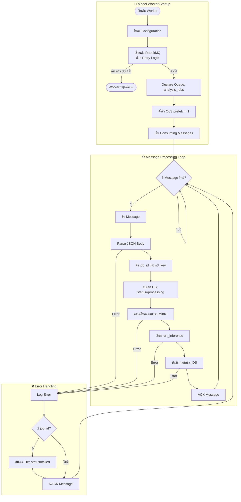
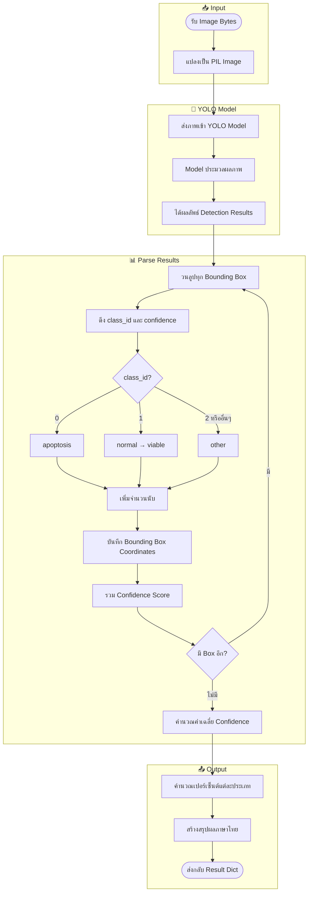

# Activity Diagram: การวิเคราะห์ภาพเซลล์ด้วย AI Model

## ภาพรวมกระบวนการวิเคราะห์ภาพ

แผนภาพกิจกรรม (Activity Diagram) นี้แสดงขั้นตอนการทำงานของระบบวิเคราะห์ภาพเซลล์ตั้งแต่ผู้ใช้ส่งคำขอวิเคราะห์ภาพจนถึงการแสดงผลลัพธ์

```mermaid
flowchart TB
    subgraph Client["🖥️ Client (Frontend)"]
        A([เริ่มต้น]) --> B[ผู้ใช้เลือกภาพที่ต้องการวิเคราะห์]
        B --> C[ส่งคำขอ POST /api/v1/images/{id}/analyze]
    end

    subgraph Backend["⚙️ Rust Backend Server"]
        C --> D{ตรวจสอบสิทธิ์ผู้ใช้}
        D -->|ไม่ผ่าน| E[ส่งกลับ 401 Unauthorized]
        E --> Z1([จบการทำงาน])
        
        D -->|ผ่าน| F{ตรวจสอบความเป็นเจ้าของภาพ}
        F -->|ไม่พบภาพ| G[ส่งกลับ 404 Not Found]
        G --> Z1
        
        F -->|ผ่าน| H[สร้าง Job ใน Database\nสถานะ: pending]
        H --> I[สร้าง AnalysisJobMessage]
        I --> J[Publish Message ไปยัง RabbitMQ]
        
        J -->|ล้มเหลว| K[อัปเดต Job เป็น failed]
        K --> L[ส่งกลับ 500 Queue Error]
        L --> Z1
        
        J -->|สำเร็จ| M[ส่งกลับ 202 Accepted\nพร้อม job_id และ status_url]
    end

    subgraph RabbitMQ["📨 RabbitMQ Message Queue"]
        M --> N[Message เข้าคิว analysis_jobs]
        N --> O[รอ Model Worker รับ Message]
    end

    subgraph ModelWorker["🤖 Python Model Worker"]
        O --> P[รับ Message จากคิว]
        P --> Q[Parse JSON Message\nดึง job_id, s3_key]
        Q --> R[อัปเดต Job เป็น processing\nเริ่มจับเวลา]
        
        R --> S[ดาวน์โหลดภาพจาก MinIO\nใช้ s3_key]
        S -->|ล้มเหลว| AA[บันทึก Error]
        
        S -->|สำเร็จ| T[โหลดภาพเป็น PIL Image]
        T --> U[ส่งภาพเข้า YOLO Model\nทำ Inference]
    end

    subgraph Inference["🔬 YOLO Inference Process"]
        U --> V[วิเคราะห์ภาพด้วย YOLO]
        V --> W[ตรวจจับเซลล์และจำแนกประเภท]
        W --> X[นับจำนวนเซลล์แต่ละประเภท\n- Normal/Viable\n- Apoptosis\n- Other]
        X --> Y[คำนวณค่า Confidence เฉลี่ย]
        Y --> Y2[สร้าง Bounding Boxes Data]
        Y2 --> Y3[สร้างสรุปผลภาษาไทย]
    end

    subgraph SaveResult["💾 บันทึกผลลัพธ์"]
        Y3 --> AB[บันทึก analysis_results\nลง PostgreSQL]
        AB --> AC[อัปเดต Job เป็น completed\nบันทึก finished_at]
        AC --> AD[ACK Message ใน RabbitMQ]
        
        AA --> AE[อัปเดต Job เป็น failed\nบันทึก error_message]
        AE --> AF[NACK Message ใน RabbitMQ]
    end

    subgraph Polling["🔄 Client Polling"]
        AD --> AG[Client เรียก GET /api/v1/jobs/{job_id}]
        AF --> AG
        AG --> AH{ตรวจสอบสถานะ Job}
        AH -->|pending/processing| AI[รอแล้ว Poll ใหม่]
        AI --> AG
        AH -->|failed| AJ[แสดง Error Message]
        AJ --> Z2([จบการทำงาน])
        AH -->|completed| AK[เรียก GET /api/v1/jobs/{job_id}/result]
    end

    subgraph DisplayResult["📊 แสดงผลลัพธ์"]
        AK --> AL[รับข้อมูลผลการวิเคราะห์]
        AL --> AM[แสดงจำนวนเซลล์แต่ละประเภท]
        AM --> AN[แสดงเปอร์เซ็นต์และ Confidence]
        AN --> AO[แสดง Bounding Boxes บนภาพ]
        AO --> AP[แสดงสรุปผลการวิเคราะห์]
        AP --> Z3([จบการทำงาน])
    end
```

---

## Activity Diagram: กระบวนการทำงานของ Model Worker



---

## Activity Diagram: YOLO Inference Process



---

## สรุปส่วนประกอบหลัก

| Component | เทคโนโลยี | หน้าที่หลัก |
|-----------|----------|------------|
| **Backend Server** | Rust + Actix-web | รับ API Request, สร้าง Job, Publish Message |
| **Message Queue** | RabbitMQ | จัดคิวงานวิเคราะห์แบบ Async |
| **Model Worker** | Python + YOLO | ประมวลผลภาพด้วย Deep Learning |
| **Object Storage** | MinIO (S3) | เก็บภาพต้นฉบับ |
| **Database** | PostgreSQL | จัดเก็บ Job Status และผลการวิเคราะห์ |
