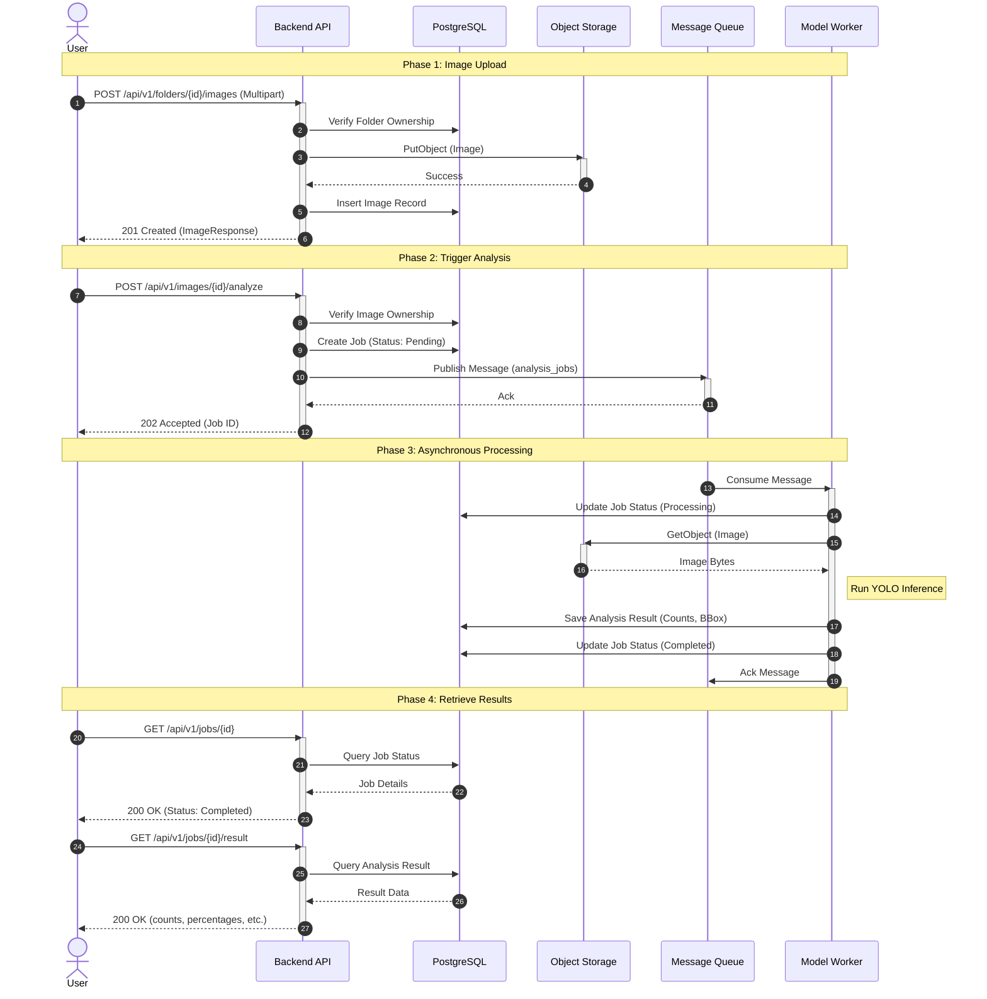

```mermaid
sequenceDiagram
    autonumber
    actor User
    participant Server as Backend API
    participant DB as PostgreSQL
    participant MinIO as Object Storage
    participant RabbitMQ as Message Queue
    participant Worker as Model Worker

    Note over User, Worker: Phase 1: Image Upload

    User->>Server: POST /api/v1/folders/{id}/images (Multipart)
    activate Server
    Server->>DB: Verify Folder Ownership
    Server->>MinIO: PutObject (Image)
    activate MinIO
    MinIO-->>Server: Success
    deactivate MinIO
    Server->>DB: Insert Image Record
    Server-->>User: 201 Created (ImageResponse)
    deactivate Server

    Note over User, Worker: Phase 2: Trigger Analysis

    User->>Server: POST /api/v1/images/{id}/analyze
    activate Server
    Server->>DB: Verify Image Ownership
    Server->>DB: Create Job (Status: Pending)
    Server->>RabbitMQ: Publish Message (analysis_jobs)
    activate RabbitMQ
    RabbitMQ-->>Server: Ack
    deactivate RabbitMQ
    Server-->>User: 202 Accepted (Job ID)
    deactivate Server

    Note over User, Worker: Phase 3: Asynchronous Processing

    RabbitMQ->>Worker: Consume Message
    activate Worker
    Worker->>DB: Update Job Status (Processing)
    Worker->>MinIO: GetObject (Image)
    activate MinIO
    MinIO-->>Worker: Image Bytes
    deactivate MinIO
    
    Note right of Worker: Run YOLO Inference
    
    Worker->>DB: Save Analysis Result (Counts, BBox)
    Worker->>DB: Update Job Status (Completed)
    
    Worker->>RabbitMQ: Ack Message
    deactivate Worker

    Note over User, Worker: Phase 4: Retrieve Results

    User->>Server: GET /api/v1/jobs/{id}
    activate Server
    Server->>DB: Query Job Status
    DB-->>Server: Job Details
    Server-->>User: 200 OK (Status: Completed)
    deactivate Server

    User->>Server: GET /api/v1/jobs/{id}/result
    activate Server
    Server->>DB: Query Analysis Result
    DB-->>Server: Result Data
    Server-->>User: 200 OK (counts, percentages, etc.)
    deactivate Server
```