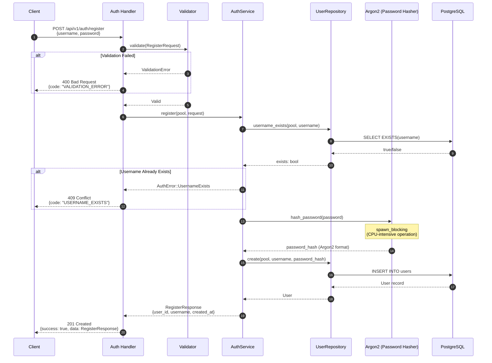
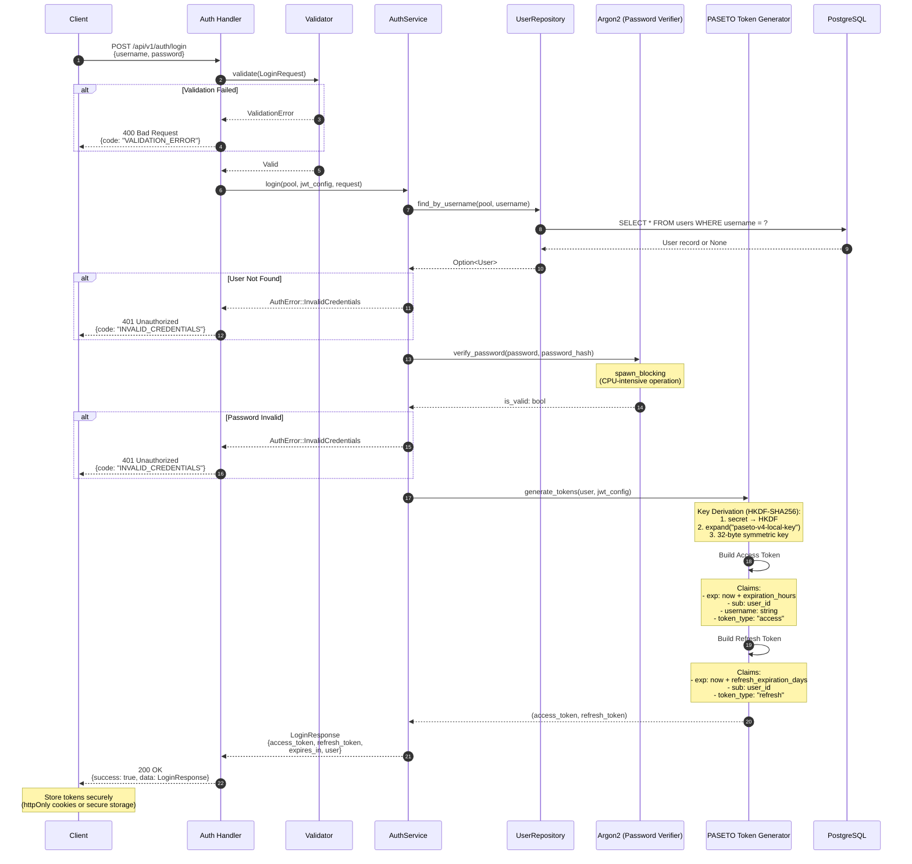
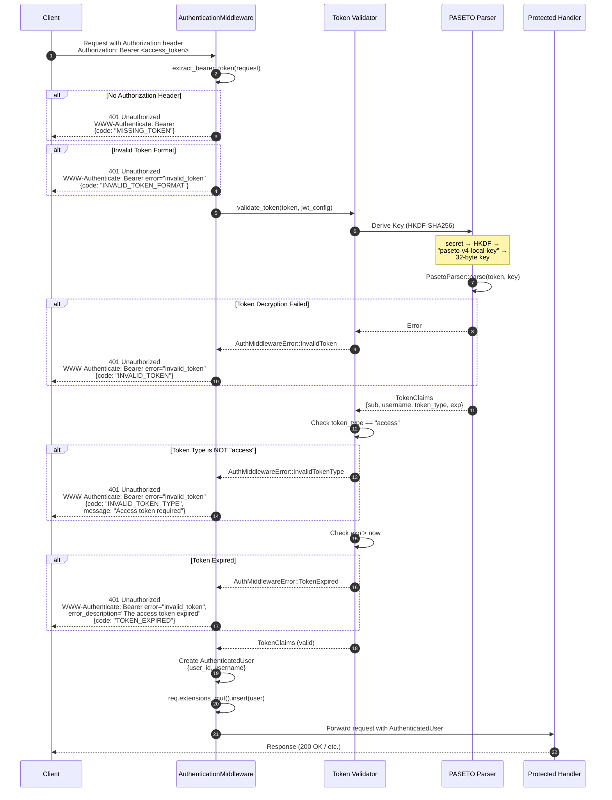
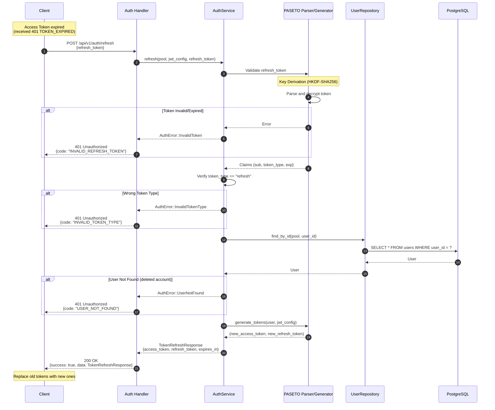
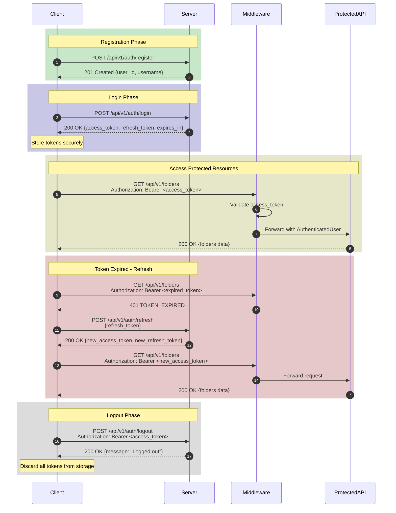

# Authentication System Documentation

## Overview

ระบบ Authentication ใช้ **PASETO (Platform-Agnostic Security Tokens)** Version 4 Local สำหรับการสร้าง Token โดยมี Token 2 ประเภท:

- **Access Token**: ใช้สำหรับ authenticate API requests (อายุสั้น - ค่า default คือ 1 ชั่วโมง)
- **Refresh Token**: ใช้สำหรับขอ Access Token ใหม่ (อายุยาว - ค่า default คือ 7 วัน)

### Security Standards

- **OWASP ASVS V2**: Authentication Verification Requirements
- **OWASP ASVS V4**: Access Control Verification Requirements
- **RFC 6750**: Bearer Token Usage
- **RFC 9110**: HTTP Semantics
- **NIST SP 800-63B**: Password Guidelines

---

## Sequence Diagrams

### 1. Register Flow



### 2. Login Flow



### 3. Authentication Middleware Flow



### 4. Token Refresh Flow (Conceptual)



### 5. Complete Authentication Lifecycle



---

## Token Structure

### Access Token (PASETO v4.local)

| Claim | Type | Description |
|-------|------|-------------|
| `exp` | RFC 3339 datetime | Expiration time (configurable, default: 1 hour) |
| `sub` | UUID string | User ID |
| `username` | string | Username |
| `token_type` | string | Always `"access"` |

### Refresh Token (PASETO v4.local)

| Claim | Type | Description |
|-------|------|-------------|
| `exp` | RFC 3339 datetime | Expiration time (configurable, default: 7 days) |
| `sub` | UUID string | User ID |
| `token_type` | string | Always `"refresh"` |

---

## Password Requirements (NIST SP 800-63B)

- Minimum **12 characters**
- At least **1 uppercase letter**
- At least **1 lowercase letter**
- At least **1 digit**
- At least **1 special character**

---

## Error Codes

| Code | HTTP Status | Description |
|------|-------------|-------------|
| `VALIDATION_ERROR` | 400 | Request validation failed |
| `USERNAME_EXISTS` | 409 | Username already taken |
| `INVALID_CREDENTIALS` | 401 | Wrong username or password |
| `MISSING_TOKEN` | 401 | No Authorization header |
| `INVALID_TOKEN_FORMAT` | 401 | Token format invalid (not `Bearer <token>`) |
| `INVALID_TOKEN` | 401 | Token decryption/parsing failed |
| `TOKEN_EXPIRED` | 401 | Token has expired |
| `INVALID_TOKEN_TYPE` | 401 | Wrong token type (e.g., using refresh token as access) |

---

## Configuration

Environment variables for JWT/PASETO configuration:

```env
JWT__SECRET=your-secret-key-at-least-32-characters
JWT__EXPIRATION_HOURS=1
JWT__REFRESH_EXPIRATION_DAYS=7
```

---

## Security Notes

1. **Stateless Authentication**: Server ไม่เก็บ session state, tokens เป็น self-contained
2. **Token Encryption**: ใช้ PASETO v4.local (symmetric encryption) แทน JWT เพื่อความปลอดภัยที่ดีกว่า
3. **Key Derivation**: ใช้ HKDF-SHA256 (RFC 5869) เพื่อ derive key จาก secret
4. **CPU-bound Operations**: Password hashing/verification ใช้ `spawn_blocking` เพื่อไม่ block async runtime
5. **WWW-Authenticate Header**: Response 401 จะมี header ตาม RFC 6750 เพื่อบอก client ว่าต้องทำอย่างไร
