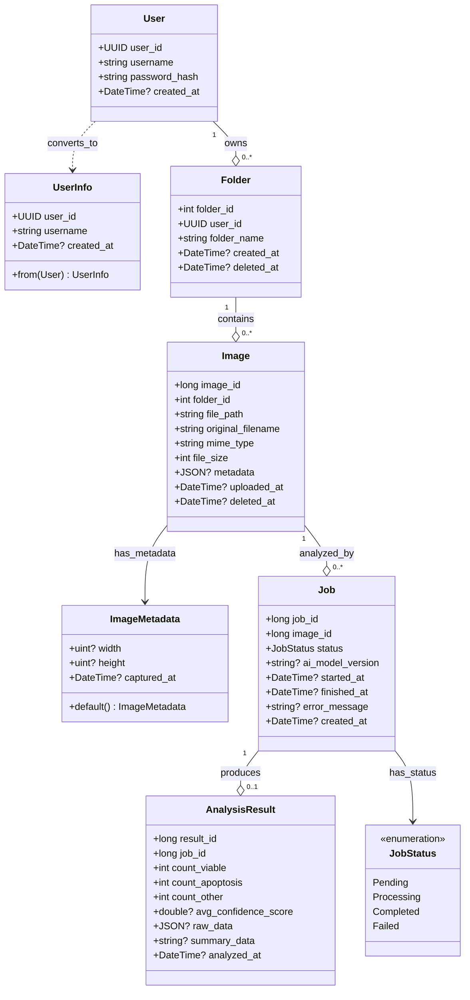
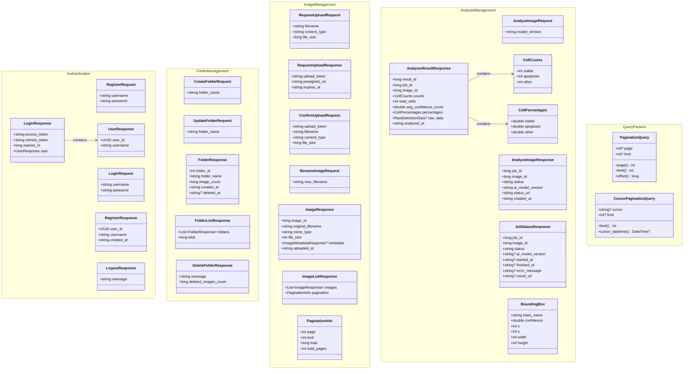
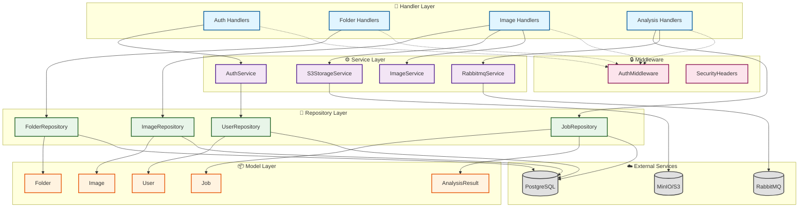

# Class Diagram - Cell Analysis Backend

โครงสร้างของ Rust Backend Application ที่แสดง struct, trait, และความสัมพันธ์ระหว่าง modules

---

## 1. Entity Layer (Domain Models)

### Entity Description

| Entity | คำอธิบาย |
|--------|---------|
| **User** | ผู้ใช้ในระบบ เก็บข้อมูล authentication |
| **Folder** | โฟลเดอร์จัดกลุ่มรูปภาพ รองรับ soft delete |
| **Image** | ข้อมูลรูปภาพที่อัพโหลด รองรับ soft delete |
| **Job** | งานวิเคราะห์ AI พร้อม status tracking |
| **AnalysisResult** | ผลลัพธ์การนับเซลล์ (viable, apoptosis, other) |

---

## 2. DTO Layer (Data Transfer Objects)

### DTO Categories

| Category | Request DTOs | Response DTOs |
|----------|-------------|---------------|
| **Auth** | RegisterRequest, LoginRequest | RegisterResponse, LoginResponse, LogoutResponse |
| **Folder** | CreateFolderRequest, UpdateFolderRequest | FolderResponse, FolderListResponse, DeleteFolderResponse |
| **Image** | RequestUploadRequest, ConfirmUploadRequest, RenameImageRequest | RequestUploadResponse, ImageResponse, ImageListResponse |
| **Analysis** | AnalyzeImageRequest | AnalyzeImageResponse, JobStatusResponse, AnalysisResultResponse |

---

## 3. Logic Layer (Services, Repositories, Middleware)

```mermaid
classDiagram
    direction TB
    
    %% ========================================
    %% Repositories (Data Access)
    %% ========================================
    class UserRepository {
        <<repository>>
        +create(pool, username, password_hash) Result~User~
        +find_by_username(pool, username) Result~User?~
        +find_by_id(pool, user_id) Result~User?~
        +username_exists(pool, username) Result~boolean~
    }
    
    class FolderRepository {
        <<repository>>
        +create(pool, user_id, folder_name) Result~Folder~
        +find_by_user_id(pool, user_id) Result~List~Folder~~
        +find_by_id(pool, folder_id, user_id) Result~Folder?~
        +update(pool, folder_id, user_id, new_name) Result~Folder~
        +soft_delete(pool, folder_id, user_id) Result~void~
        +count_images(pool, folder_id) Result~long~
    }
    
    class ImageRepository {
        <<repository>>
        +create(pool, folder_id, file_path, ...) Result~Image~
        +find_by_folder_id(pool, folder_id, limit, offset) Result~List~Image~~
        +find_by_folder_id_cursor(pool, folder_id, cursor, limit) Result~List~Image~~
        +count_by_folder_id(pool, folder_id) Result~long~
        +find_by_id(pool, image_id, user_id) Result~Image?~
        +update_filename(pool, image_id, user_id, new_filename) Result~Image~
        +soft_delete(pool, image_id, user_id) Result~void~
        +soft_delete_by_folder(pool, folder_id) Result~long~
    }
    
    class JobRepository {
        <<repository>>
        +create(pool, image_id, model_version) Result~Job~
        +find_by_id(pool, job_id, user_id) Result~Job?~
        +start_processing(pool, job_id) Result~void~
        +complete(pool, job_id) Result~void~
        +fail(pool, job_id, error_message) Result~void~
        +get_history_by_image(pool, image_id, user_id) Result~List~Job~~
        +create_result(pool, job_id, counts, ...) Result~AnalysisResult~
        +get_result_by_job(pool, job_id, user_id) Result~AnalysisResult?~
    }
    
    %% ========================================
    %% Services (Business Logic)
    %% ========================================
    class AuthService {
        <<service>>
        +register(pool, request) Result~RegisterResponse~
        +login(pool, jwt_config, request) Result~LoginResponse~
        -hash_password(password) Result~string~
        -verify_password(password, hash) Result~boolean~
        -generate_tokens(user, jwt_config) Result~Tokens~
    }
    
    class S3StorageService {
        <<service>>
        -bucket Bucket
        -presign_bucket Bucket
        -presign_expiry_secs long
        +new(config) Result~S3StorageService~
        +upload_file(key, bytes, content_type) Result~void~
        +download_file(key) Result~bytes~
        +delete_file(key) Result~void~
        +presigned_put_url(key, content_type) Result~string~
        +presigned_get_url(key) Result~string~
        +file_exists(key) Result~boolean~
    }
    
    class RabbitmqService {
        <<service>>
        -channel Channel
        -queue_name string
        +new(config) Result~RabbitmqService~
        +publish_analysis_job(message) Result~void~
    }
    
    class ImageService {
        <<service>>
        +validate_file(content_type, bytes) Result~void~
        +generate_storage_path(original_filename) Tuple~string, string~
        +save_to_disk(bytes, storage_path) Result~void~
        +extract_metadata(bytes) Result~ImageMetadata~
    }
    
    class AnalysisJobMessage {
        <<message>>
        +long job_id
        +long image_id
        +string s3_key
        +string model_version
        +string created_at
    }
    
    %% ========================================
    %% Middleware
    %% ========================================
    class AuthMiddleware {
        <<middleware>>
        -jwt_config JwtConfig
        +new(jwt_config) AuthMiddleware
        +verify_token(token, config) Result~TokenClaims~
    }
    
    class AuthenticatedUser {
        <<context>>
        +UUID user_id
        +string username
    }
    
    class TokenClaims {
        <<claims>>
        +string sub
        +string username
        +string token_type
    }
    
    class SecurityHeadersMiddleware {
        <<middleware>>
        +add_security_headers(response) Response
    }
    
    %% ========================================
    %% Error Types
    %% ========================================
    class AuthError {
        <<error>>
        UsernameExists
        InvalidCredentials
        HashingError
        TokenError
        DatabaseError
        ValidationError
    }
    
    class S3Error {
        <<error>>
        CredentialsError
        BucketError
        UploadError
        DownloadError
        DeleteError
        NotFound
    }
    
    class RabbitmqError {
        <<error>>
        Connection
        Channel
        QueueDeclare
        Publish
        Serialize
        NotConnected
    }
    
    class ImageServiceError {
        <<error>>
        InvalidFileType
        InvalidMagicBytes
        FileTooLarge
        SaveError
        IoError
    }
    
    %% ========================================
    %% Relationships
    %% ========================================
    AuthService ..> UserRepository : uses
    AuthService --> AuthError : throws
    
    S3StorageService --> S3Error : throws
    
    RabbitmqService ..> AnalysisJobMessage : publishes
    RabbitmqService --> RabbitmqError : throws
    
    ImageService --> ImageServiceError : throws
    
    AuthMiddleware ..> TokenClaims : validates
    AuthMiddleware ..> AuthenticatedUser : produces
```

---

## 4. Module Dependencies Overview

---

## Type Mapping Reference

| Language-Neutral | Rust | TypeScript | Java |
|-----------------|------|------------|------|
| `int` | `i32` | `number` | `int` |
| `long` | `i64` | `number` | `long` |
| `uint` | `u32` | `number` | `int` |
| `double` | `f64` | `number` | `double` |
| `string` | `String` | `string` | `String` |
| `boolean` | `bool` | `boolean` | `boolean` |
| `UUID` | `Uuid` | `string` | `UUID` |
| `DateTime` | `DateTime<Utc>` | `Date` | `Instant` |
| `T?` | `Option<T>` | `T \| null` | `Optional<T>` |
| `List<T>` | `Vec<T>` | `T[]` | `List<T>` |
| `JSON` | `serde_json::Value` | `object` | `JsonNode` |
| `Result<T>` | `Result<T, E>` | `Promise<T>` | `T throws E` |

---

## Summary

### Architecture Layers

| Layer | Responsibility | Components |
|-------|---------------|------------|
| **Handler** | HTTP request/response handling | AuthHandlers, FolderHandlers, ImageHandlers, AnalysisHandlers |
| **Service** | Business logic & external integrations | AuthService, S3StorageService, RabbitmqService, ImageService |
| **Repository** | Data persistence & queries | UserRepository, FolderRepository, ImageRepository, JobRepository |
| **Model** | Domain entities | User, Folder, Image, Job, AnalysisResult |
| **DTO** | API contracts | Request/Response objects |
| **Middleware** | Cross-cutting concerns | AuthMiddleware, SecurityHeaders |
