# Class Diagram - Cell Analysis Backend

โครงสร้างของ Rust Backend Application ที่แสดง struct, trait, และความสัมพันธ์ระหว่าง modules

---

## 1. Entity Layer (Domain Models)

### Entity Description

| Entity | คำอธิบาย |
|--------|---------|
| **User** | ผู้ใช้ในระบบ เก็บข้อมูล authentication |
| **Folder** | โฟลเดอร์จัดกลุ่มรูปภาพ รองรับ soft delete |
| **Image** | ข้อมูลรูปภาพที่อัพโหลด รองรับ soft delete |
| **Job** | งานวิเคราะห์ AI พร้อม status tracking |
| **AnalysisResult** | ผลลัพธ์การนับเซลล์ (viable, apoptosis, other) |

---

## 2. DTO Layer (Data Transfer Objects)

### DTO Categories

| Category | Request DTOs | Response DTOs |
|----------|-------------|---------------|
| **Auth** | RegisterRequest, LoginRequest | RegisterResponse, LoginResponse, LogoutResponse |
| **Folder** | CreateFolderRequest, UpdateFolderRequest | FolderResponse, FolderListResponse, DeleteFolderResponse |
| **Image** | RequestUploadRequest, ConfirmUploadRequest, RenameImageRequest | RequestUploadResponse, ImageResponse, ImageListResponse |
| **Analysis** | AnalyzeImageRequest | AnalyzeImageResponse, JobStatusResponse, AnalysisResultResponse |

---

## 3. Logic Layer (Services, Repositories, Middleware)

---

## 4. Module Dependencies Overview

```mermaid
graph TB
    subgraph Handlers["🎯 Handler Layer"]
        AH[Auth Handlers]
        FH[Folder Handlers]
        IH[Image Handlers]
        ANH[Analysis Handlers]
    end
    
    subgraph Services["⚙️ Service Layer"]
        AS[AuthService]
        S3[S3StorageService]
        RMQ[RabbitmqService]
        IS[ImageService]
    end
    
    subgraph Repositories["💾 Repository Layer"]
        UR[UserRepository]
        FR[FolderRepository]
        IR[ImageRepository]
        JR[JobRepository]
    end
    
    subgraph Models["📦 Model Layer"]
        U[User]
        F[Folder]
        I[Image]
        J[Job]
        AR[AnalysisResult]
    end
    
    subgraph Middleware["🔒 Middleware"]
        AM[AuthMiddleware]
        SH[SecurityHeaders]
    end
    
    subgraph External["☁️ External Services"]
        DB[(PostgreSQL)]
        MINIO[(MinIO/S3)]
        RABBIT[(RabbitMQ)]
    end
    
    AH --> AS
    FH --> FR
    IH --> IR
    IH --> S3
    IH --> IS
    ANH --> JR
    ANH --> RMQ
    
    AS --> UR
    
    UR --> U
    FR --> F
    IR --> I
    JR --> J
    JR --> AR
    
    AH -.-> AM
    FH -.-> AM
    IH -.-> AM
    ANH -.-> AM
    
    UR --> DB
    FR --> DB
    IR --> DB
    JR --> DB
    
    S3 --> MINIO
    RMQ --> RABBIT
    
    classDef handlerStyle fill:#e1f5ff,stroke:#01579b,stroke-width:2px
    classDef serviceStyle fill:#f3e5f5,stroke:#4a148c,stroke-width:2px
    classDef repoStyle fill:#e8f5e9,stroke:#1b5e20,stroke-width:2px
    classDef modelStyle fill:#fff3e0,stroke:#e65100,stroke-width:2px
    classDef middlewareStyle fill:#fce4ec,stroke:#880e4f,stroke-width:2px
    classDef externalStyle fill:#e0e0e0,stroke:#424242,stroke-width:2px
    
    class AH,FH,IH,ANH handlerStyle
    class AS,S3,RMQ,IS serviceStyle
    class UR,FR,IR,JR repoStyle
    class U,F,I,J,AR modelStyle
    class AM,SH middlewareStyle
    class DB,MINIO,RABBIT externalStyle
```

---

## Type Mapping Reference

| Language-Neutral | Rust | TypeScript | Java |
|-----------------|------|------------|------|
| `int` | `i32` | `number` | `int` |
| `long` | `i64` | `number` | `long` |
| `uint` | `u32` | `number` | `int` |
| `double` | `f64` | `number` | `double` |
| `string` | `String` | `string` | `String` |
| `boolean` | `bool` | `boolean` | `boolean` |
| `UUID` | `Uuid` | `string` | `UUID` |
| `DateTime` | `DateTime<Utc>` | `Date` | `Instant` |
| `T?` | `Option<T>` | `T \| null` | `Optional<T>` |
| `List<T>` | `Vec<T>` | `T[]` | `List<T>` |
| `JSON` | `serde_json::Value` | `object` | `JsonNode` |
| `Result<T>` | `Result<T, E>` | `Promise<T>` | `T throws E` |

---

## Summary

### Architecture Layers

| Layer | Responsibility | Components |
|-------|---------------|------------|
| **Handler** | HTTP request/response handling | AuthHandlers, FolderHandlers, ImageHandlers, AnalysisHandlers |
| **Service** | Business logic & external integrations | AuthService, S3StorageService, RabbitmqService, ImageService |
| **Repository** | Data persistence & queries | UserRepository, FolderRepository, ImageRepository, JobRepository |
| **Model** | Domain entities | User, Folder, Image, Job, AnalysisResult |
| **DTO** | API contracts | Request/Response objects |
| **Middleware** | Cross-cutting concerns | AuthMiddleware, SecurityHeaders |
