# System Architecture - Cell Analysis Application

## High-Level System Architecture

```mermaid
graph TB
    subgraph Client["📱 Client Layer"]
        Mobile["Flutter Mobile App<br/>(iOS/Android)"]
    end

    subgraph Gateway["🌐 API Gateway"]
        Nginx["Nginx<br/>Reverse Proxy"]
    end

    subgraph Backend["⚙️ Backend Services"]
        Rust["🦀 Rust Backend<br/>(Actix-web)"]
        
        subgraph Modules["Application Modules"]
            Auth["Auth Module"]
            Folder["Folder Module"]
            Image["Image Module"]
            Analysis["Analysis Module"]
        end
    end

    subgraph MessageBroker["📨 Message Queue"]
        RabbitMQ["RabbitMQ<br/>Message Broker"]
    end

    subgraph AIService["🤖 AI Service Layer"]
        Python["Python AI Worker<br/>(Deep Learning)"]
        Model["Cell Classification Model<br/>(Viable | Apoptosis | Other)"]
    end

    subgraph Storage["💾 Storage Layer"]
        PostgreSQL["PostgreSQL<br/>Database"]
        MinIO["MinIO<br/>S3-Compatible Storage"]
    end

    %% Client connections
    Mobile -->|HTTPS/REST API| Nginx
    Nginx -->|HTTP| Rust
    
    %% Backend internal
    Rust --> Auth
    Rust --> Folder
    Rust --> Image
    Rust --> Analysis
    
    %% Backend to Storage
    Rust -->|SQL Queries| PostgreSQL
    Rust -->|Presigned URLs| MinIO
    
    %% Async AI Processing
    Analysis -->|Publish Job| RabbitMQ
    RabbitMQ -->|Consume Job| Python
    Python --> Model
    Python -->|Save Results| PostgreSQL
    Python -->|Fetch Image| MinIO

    classDef client fill:#e1f5fe,stroke:#01579b
    classDef backend fill:#fff3e0,stroke:#e65100
    classDef storage fill:#e8f5e9,stroke:#2e7d32
    classDef ai fill:#fce4ec,stroke:#c2185b
    classDef mq fill:#f3e5f5,stroke:#7b1fa2

    class Mobile client
    class Rust,Auth,Folder,Image,Analysis backend
    class PostgreSQL,MinIO storage
    class Python,Model ai
    class RabbitMQ mq
```

---

## Detailed Architecture with Data Flow

---

## Container Architecture (Docker)

```mermaid
graph TB
    subgraph DockerNetwork["Docker Network: app-network"]
        direction LR
        
        subgraph Backend["backend:8080"]
            RustApp["🦀 Rust Backend<br/>Actix-web"]
        end
        
        subgraph DB["postgres:5432"]
            PG["🐘 PostgreSQL 16<br/>Alpine"]
        end
        
        subgraph Storage["minio:9000/9001"]
            S3["📦 MinIO<br/>S3 Storage"]
        end
        
        subgraph MQ["rabbitmq:5672/15672"]
            Rabbit["🐰 RabbitMQ<br/>Message Broker"]
        end
        
        subgraph AI["ai-worker:5000"]
            PyWorker["🐍 Python Worker<br/>Deep Learning"]
        end
        
        subgraph Tools["Developer Tools (Optional)"]
            PGAdmin["pgAdmin4:5050"]
        end
    end

    RustApp -->|"SQL"| PG
    RustApp -->|"S3 API"| S3
    RustApp -->|"AMQP"| Rabbit
    Rabbit -->|"Consume Jobs"| PyWorker
    PyWorker -->|"Fetch Images"| S3
    PyWorker -->|"Save Results"| PG
    PGAdmin -.->|"Admin"| PG

    classDef rust fill:#dea584,stroke:#000
    classDef python fill:#3776ab,stroke:#000,color:#fff
    classDef db fill:#336791,stroke:#000,color:#fff
    classDef storage fill:#c72c48,stroke:#000,color:#fff
    classDef mq fill:#ff6600,stroke:#000

    class RustApp rust
    class PyWorker python
    class PG db
    class S3 storage
    class Rabbit mq
```

---

## Data Flow: Image Analysis Process

```mermaid
sequenceDiagram
    autonumber
    participant User as 👤 User
    participant App as 📱 Flutter App
    participant API as 🦀 Rust Backend
    participant MQ as 🐰 RabbitMQ
    participant AI as 🐍 Python AI Worker
    participant DB as 🗄️ PostgreSQL
    participant S3 as 📦 MinIO

    Note over User, S3: Image Upload & Analysis Flow

    User->>App: Select image & analyze
    App->>API: POST /api/images/upload
    API->>S3: Generate Presigned URL
    S3-->>API: Return upload URL
    API-->>App: Return presigned URL
    App->>S3: Direct upload image
    
    App->>API: POST /api/analysis/request
    API->>DB: INSERT job (status: pending)
    API->>MQ: Publish to analysis.jobs queue
    API-->>App: 202 Accepted (job_id)
    
    Note over MQ, AI: Async Processing

    MQ->>AI: Consume job message
    AI->>S3: Fetch image data
    S3-->>AI: Return image bytes
    AI->>AI: Run classification model
    
    Note right of AI: Classify into:<br/>• Viable<br/>• Apoptosis<br/>• Other

    AI->>DB: INSERT analysis_results
    AI->>DB: UPDATE job (status: completed)
    AI->>MQ: Publish completion event
    
    Note over App: Polling for results

    loop Poll Status
        App->>API: GET /api/analysis/{job_id}/status
        API->>DB: SELECT job status
        DB-->>API: Return status
        API-->>App: Return status (pending/completed)
    end

    App->>API: GET /api/analysis/{job_id}/result
    API->>DB: SELECT analysis_results
    DB-->>API: Return results
    API-->>App: Return analysis JSON
    App-->>User: Display results (Graph/Chart)
```

---

## Module Relationships

```mermaid
graph LR
    subgraph Modules["🧩 Application Modules"]
        Auth["🔐 Authentication<br/>• Register<br/>• Login<br/>• Logout<br/>• JWT/PASETO"]
        
        Folder["📁 Folder Management<br/>• Create<br/>• Rename<br/>• Delete<br/>• List (Flat Structure)"]
        
        Image["🖼️ Image Management<br/>• Upload (Presigned URL)<br/>• View Metadata<br/>• Delete<br/>• Cursor Pagination"]
        
        Analysis["🔬 AI Analysis<br/>• Submit Analysis Job<br/>• Async Processing<br/>• View Results<br/>• History"]
    end

    Auth -->|"User Context"| Folder
    Auth -->|"User Context"| Image
    Auth -->|"User Context"| Analysis
    Folder -->|"Folder ID"| Image
    Image -->|"Image ID"| Analysis

    classDef auth fill:#ffcdd2,stroke:#c62828
    classDef folder fill:#c8e6c9,stroke:#2e7d32
    classDef image fill:#bbdefb,stroke:#1565c0
    classDef analysis fill:#e1bee7,stroke:#7b1fa2

    class Auth auth
    class Folder folder
    class Image image
    class Analysis analysis
```

---

## Technology Stack Summary

| Layer | Technology | Purpose |
|-------|------------|---------|
| **Frontend** | Flutter | Cross-platform mobile app (iOS/Android) |
| **Backend** | Rust + Actix-web | High-performance REST API |
| **Database** | PostgreSQL 16 | Relational data storage |
| **Object Storage** | MinIO (S3-compatible) | Image file storage |
| **Message Broker** | RabbitMQ | Async job queue for AI processing |
| **AI Service** | Python + Deep Learning | Cell classification model |
| **Auth** | PASETO v4 | Secure token-based authentication |
| **Containerization** | Docker Compose | Service orchestration |
