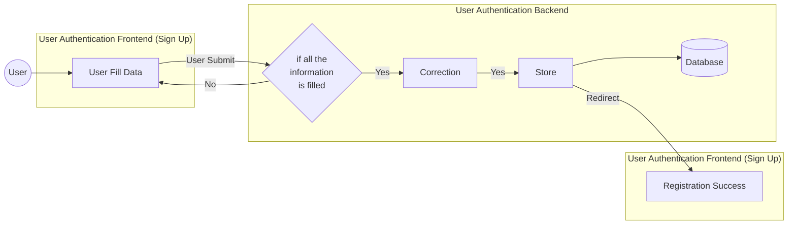
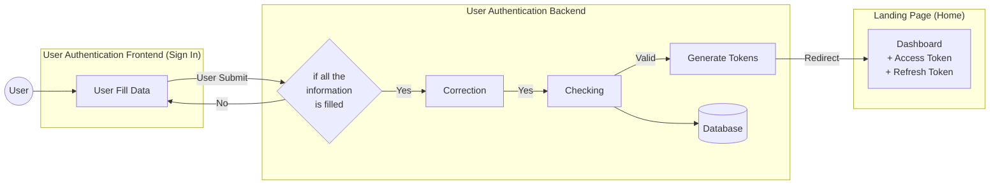

# Authentication Activity Diagram

## 1. Sign Up (Register)



**ขั้นตอน Register:**
1. User กรอก username, password ที่หน้า Sign Up
2. User กด Submit
3. ตรวจสอบข้อมูลครบหรือไม่ → ถ้าไม่ครบกลับไปกรอกใหม่
4. **Correction** (Validate):
   - username: 3-255 ตัวอักษร
   - password: 12+ ตัวอักษร + uppercase + lowercase + digit + special char
5. **Store**: Hash password (Argon2) แล้วบันทึก Database
6. Redirect ไปหน้า Success

---

## 2. Sign In (Login)



**ขั้นตอน Login:**
1. User กรอก username, password ที่หน้า Sign In
2. User กด Submit
3. ตรวจสอบข้อมูลครบหรือไม่ → ถ้าไม่ครบกลับไปกรอกใหม่
4. **Correction**: Validate format
5. **Checking**: ตรวจสอบกับ Database
   - ค้นหา user จาก username
   - ตรวจสอบ password ด้วย Argon2 verify
6. **Generate Tokens**: สร้าง PASETO Tokens
   - `access_token` (ใช้เข้าถึง API)
   - `refresh_token` (ใช้ขอ access token ใหม่)
   - `expires_in` (เวลาหมดอายุ)
7. Redirect ไป Dashboard พร้อม tokens

---

## Token Response Structure

```json
{
  "access_token": "v4.local.xxx...",
  "refresh_token": "v4.local.xxx...",
  "expires_in": 3600,
  "user": {
    "user_id": "uuid",
    "username": "string"
  }
}
```

---

## Components Reference

| Component | File | Description |
|-----------|------|-------------|
| Auth Handler | `auth_handlers.rs` | จัดการ register, login, logout |
| Auth DTO | `auth.rs` | Request/Response structs |
| Auth Middleware | `middleware/auth.rs` | ตรวจสอบ PASETO token |
| Security Headers | `security_headers.rs` | OWASP security headers |
| User Model | `user.rs` | user_id, username, password_hash |
